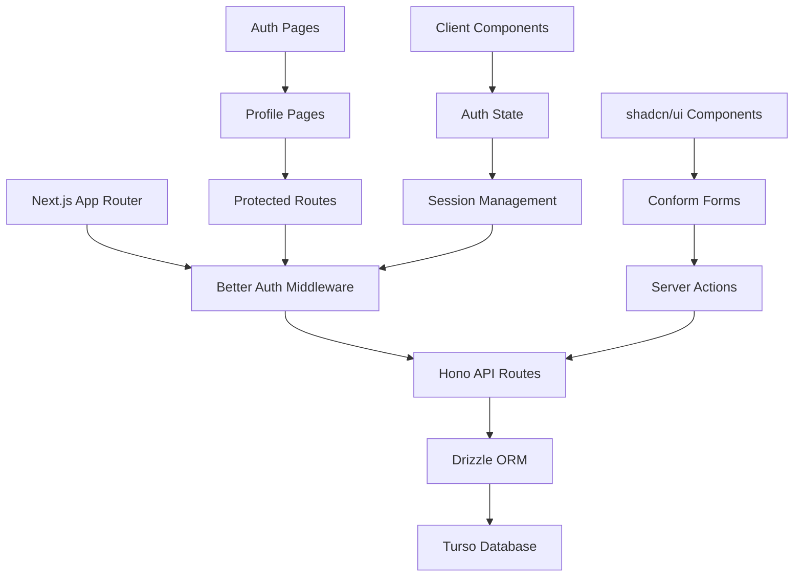
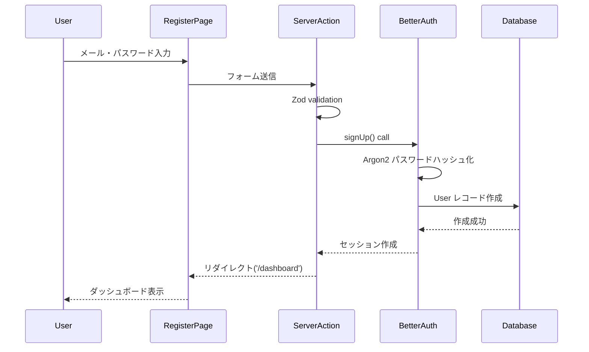
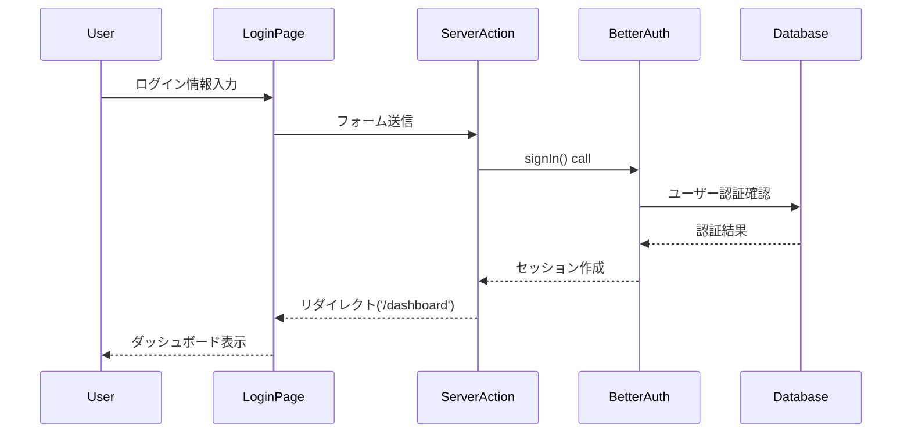
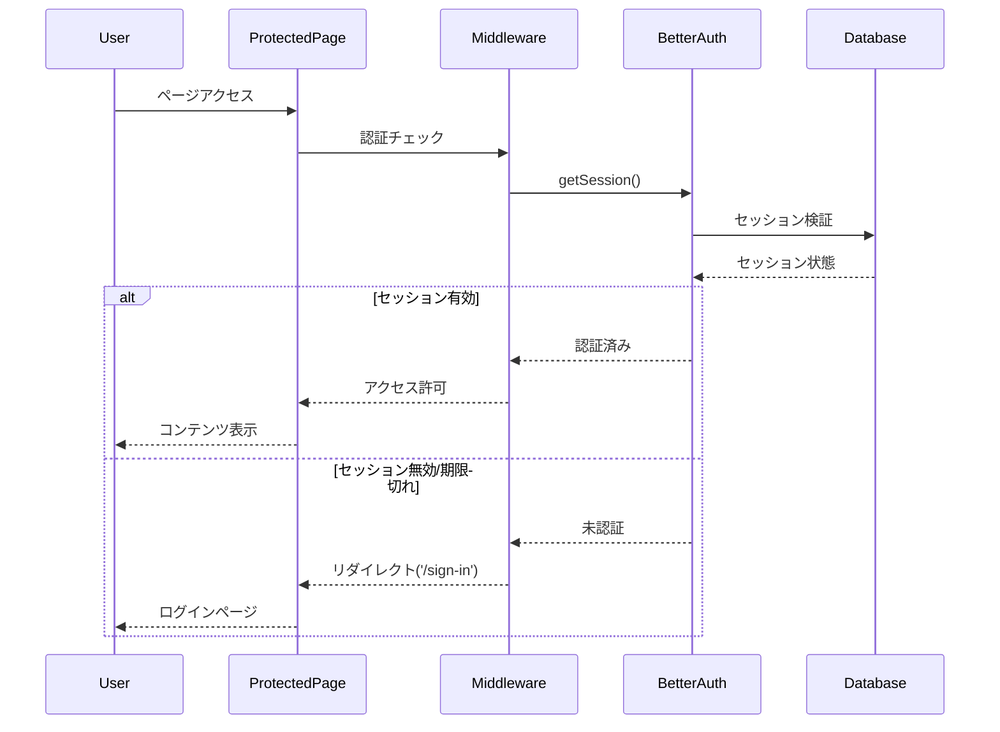
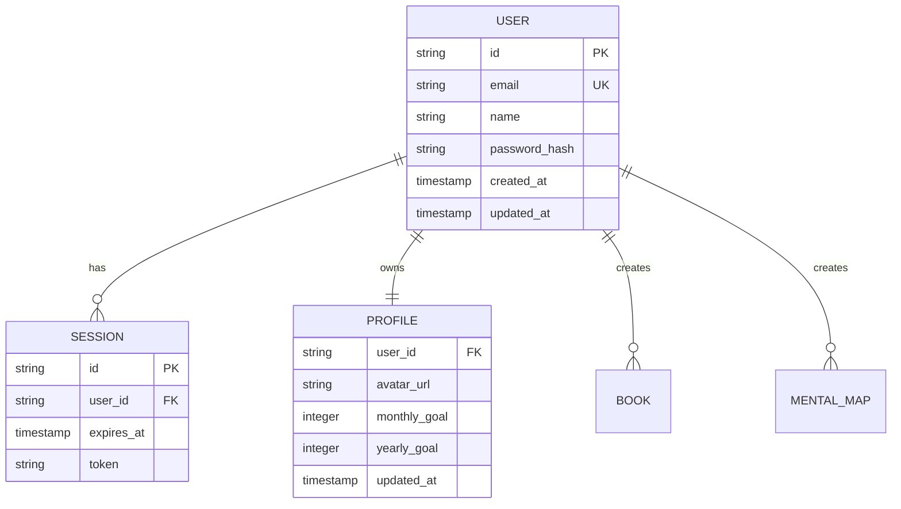
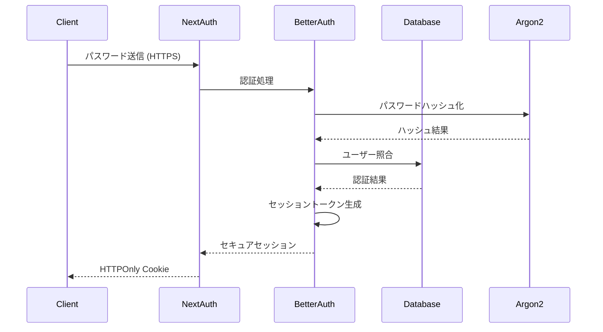
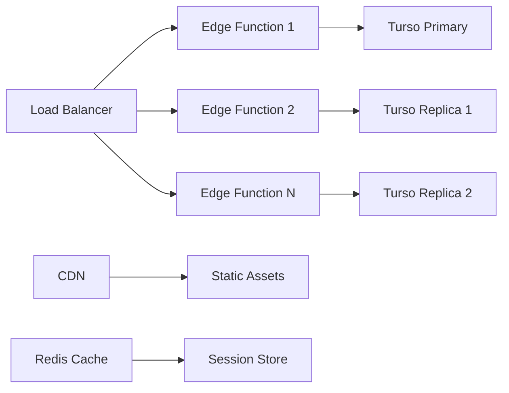
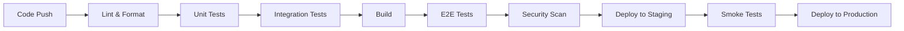

# Technical Design

## Overview

読書管理アプリケーションにおけるメール/パスワード認証システムの包括的な技術設計。Better Auth 1.3.6を中核とし、Next.js 15 App Router、TypeScript、Drizzle ORM + Turso を活用したモダンで安全な認証アーキテクチャを実装する。

セキュアなセッション管理、型安全なAPI統合、プログレッシブエンハンスメント対応により、プライベートな読書記録環境に最適化された認証システムを構築する。

## Requirements Mapping

### Design Component Traceability
各設計コンポーネントが特定の要件に対応:

- **Better Auth Config & Setup** → REQ-4: セッション管理機能、REQ-5: セキュリティ機能
- **Registration/sign-in Pages** → REQ-1: ユーザー登録機能、REQ-2: ログイン/ログアウト機能
- **Profile Management Components** → REQ-3: プロフィール管理機能
- **Authentication Middleware** → REQ-4: セッション管理機能、REQ-6: API統合
- **User Schema & API** → REQ-6: データモデル・API統合
- **Security Layers** → REQ-5: セキュリティ機能

### User Story Coverage
すべてのユーザーストーリーに対する技術的アプローチ:

- **読書愛好者のアカウント作成**: Conform + Zod による型安全なフォーム、Better Auth 統合
- **登録済みユーザーのログイン**: Server Actions によるシームレスな認証フロー
- **プロフィール情報管理**: RSC + Client Components ハイブリッドアーキテクチャ
- **セキュアなセッション管理**: Better Auth セッション + 24時間自動期限切れ
- **セキュリティ保護**: Argon2ハッシュ化、HTTPS強制、CSRF/XSS対策

## Architecture

### High-Level System Design



### Technology Stack

最新の技術スタックによる安全で高性能な認証システム:

- **Frontend**: Next.js 15.4.6 (App Router) + React 19.1.0 (RSC + Client Components)
- **Authentication**: Better Auth 1.3.6 (TypeScript-first, セッション管理)
- **Backend**: Hono 4.9.1 (Edge-first Web Framework, Type-safe RPC)
- **Database**: Drizzle ORM 0.44.4 + Turso (LibSQL, Edge locations)
- **Forms**: Conform 1.8.2 + Zod 4.0.17 (Progressive Enhancement)
- **UI**: shadcn/ui + Tailwind CSS 4.x
- **Validation**: Zod schema validation (Frontend & Backend)
- **Testing**: Vitest (Unit) + Playwright (E2E)

### Architecture Decision Rationale

技術選択の研究基盤と正当性:

- **Why Better Auth**: TypeScript-first設計、セッション管理の自動化、Next.js 15との深い統合、Argon2による安全なパスワードハッシュ化
- **Why Hono API**: Edge Runtime対応、型安全なRPC、OpenAPI自動生成、BFF(Backend for Frontend)パターンの最適化
- **Why Drizzle ORM + Turso**: Edge locations対応、SQLite互換、型安全なクエリ、マイグレーション管理の簡素化
- **Why Conform**: JavaScript無効環境でも動作、Progressive Enhancement、Server Actionsとの型安全な統合
- **Why App Router**: Server Components による初期レンダリング最適化、Server Actions による mutation 処理

## Data Flow

### Primary User Flows

#### 1. User Registration Flow



#### 2. Login Flow



#### 3. Session Management Flow



## Components and Interfaces

### Backend Services & Method Signatures
**Premise**
API endpoints and handlers are offered by better-auth

```typescript
// Better Auth 設定
class AuthService {
  signUp(email: string, password: string, name: string): Promise<User>    // ユーザー登録
  signIn(email: string, password: string): Promise<Session>               // ログイン
  signOut(): Promise<void>                                                 // ログアウト
  getSession(): Promise<Session | null>                                    // セッション取得
  updateProfile(userId: string, data: ProfileData): Promise<User>          // プロフィール更新
}

// ユーザー管理サービス
class UserService {
  createUser(data: CreateUserData): Promise<User>                          // ユーザー作成
  getUserById(id: string): Promise<User | null>                           // ユーザー取得
  updateUser(id: string, data: UpdateUserData): Promise<User>             // ユーザー更新
  deleteUser(id: string): Promise<void>                                   // ユーザー削除
  validateEmail(email: string): Promise<boolean>                          // メール重複チェック
}
```

### Frontend Components

| Component | Responsibility | Props/State Summary |
|-----------|---------------|---------------------|
| `RegisterForm` | ユーザー登録フォーム | email, password, name, errors, isPending |
| `LoginForm` | ログインフォーム | email, password, errors, isPending |
| `ProfileForm` | プロフィール編集フォーム | user, monthlyGoal, yearlyGoal, avatarUrl |
| `AuthLayout` | 認証ページレイアウト | children, title, description |
| `ProtectedRoute` | 認証保護ラッパー | children, redirectTo |
| `SessionProvider` | セッション状態管理 | session, children |
| `LogoutButton` | ログアウトボタン | variant, redirectTo |

### API Endpoints
**Premise**
API endpoints and handlers are offered by better-auth

## Data Models

### Domain Entities

1. **User**: 認証ユーザーのメインエンティティ（メール、名前、目標設定）
2. **Session**: Better Auth管理のセッション情報
3. **Profile**: 拡張プロフィール情報（アバター、読書目標）

### Entity Relationships



### Data Model Definitions
Data models have already existed.

```typescript
// User エンティティ (Drizzle ORM Schema)
export const users = sqliteTable(
  'users',
  {
    id: text('id')
      .primaryKey()
      .$defaultFn(() => crypto.randomUUID()),
    name: text('name').notNull(),
    email: text('email').notNull().unique(),
    emailVerified: integer('email_verified', { mode: 'boolean' })
      .$defaultFn(() => !1)
      .notNull(),
    image: text('image'),
    createdAt: integer('created_at', { mode: 'timestamp' })
      .$defaultFn(() => new Date())
      .notNull(),
    updatedAt: integer('updated_at', { mode: 'timestamp' })
      .$defaultFn(() => new Date())
      .notNull(),
  },
  (users) => [index('idx_users_email').on(users.email)],
)

export type User = typeof users.$inferSelect;
export type NewUser = typeof users.$inferInsert;

export const sessions = sqliteTable('sessions', {
  id: text('id')
    .primaryKey()
    .$defaultFn(() => crypto.randomUUID()),
  expiresAt: integer('expires_at', { mode: 'timestamp' }).notNull(),
  token: text('token').notNull().unique(),
  createdAt: integer('created_at', { mode: 'timestamp' }).notNull(),
  updatedAt: integer('updated_at', { mode: 'timestamp' }).notNull(),
  ipAddress: text('ip_address'),
  userAgent: text('user_agent'),
  userId: text('user_id')
    .notNull()
    .references(() => users.id, { onDelete: 'cascade' }),
})

export const accounts = sqliteTable('accounts', {
  id: text('id')
    .primaryKey()
    .$defaultFn(() => crypto.randomUUID()),
  accountId: text('account_id').notNull(),
  providerId: text('provider_id').notNull(),
  userId: text('user_id')
    .notNull()
    .references(() => users.id, { onDelete: 'cascade' }),
  accessToken: text('access_token'),
  refreshToken: text('refresh_token'),
  idToken: text('id_token'),
  accessTokenExpiresAt: integer('access_token_expires_at', {
    mode: 'timestamp',
  }),
  refreshTokenExpiresAt: integer('refresh_token_expires_at', {
    mode: 'timestamp',
  }),
  scope: text('scope'),
  password: text('password'),
  createdAt: integer('created_at', { mode: 'timestamp' }).notNull(),
  updatedAt: integer('updated_at', { mode: 'timestamp' }).notNull(),
})

export const verifications = sqliteTable('verifications', {
  id: text('id')
    .primaryKey()
    .$defaultFn(() => crypto.randomUUID()),
  identifier: text('identifier').notNull(),
  value: text('value').notNull(),
  expiresAt: integer('expires_at', { mode: 'timestamp' }).notNull(),
  createdAt: integer('created_at', { mode: 'timestamp' }).$defaultFn(() => new Date()),
  updatedAt: integer('updated_at', { mode: 'timestamp' }).$defaultFn(() => new Date()),
})
```

### Migration Strategy

- **初期マイグレーション**: Drizzle Kit による users テーブル作成
- **Better Auth自動セットアップ**: セッション関連テーブルの自動生成
- **インデックス最適化**: メール検索、セッション検証の高速化
- **データ整合性**: 外部キー制約によるユーザー・セッション関連の保護

## Validation zod schema
**features/auth/types/schemas/sign-up-schema.ts**
```typescript
import { z } from 'zod'

export const signUpSchema = z.object({
  email: z
    .email({
      error: (issue) =>
        issue.input === undefined
          ? AuthErrorHandler.handleError('REQUIRED_EMAIL', 'signUp')
          : AuthErrorHandler.handleError('INVALID_EMAIL', 'signUp'),
    })
    .max(128, { message: AuthErrorHandler.handleError('TOO_LONG_EMAIL', 'signUp')}),
  password: z
    .string({
      error: (issue) =>
        issue.input === undefined
          ? AuthErrorHandler.handleError('REQUIRED_PASSWORD', 'signUp')
          : AuthErrorHandler.handleError('INVALID_PASSWORD', 'signUp'),
    })
    .min(8, { message: AuthErrorHandler.handleError('WEEK_PASSWORD', 'signUp'), })
    .max(128, { message: AuthErrorHandler.handleError('TOO_LONG_PASSWORD', 'signUp'), }),
  name: z
  .string({
      error: (issue) =>
        issue.input === undefined
          ? AuthErrorHandler.handleError('REQUIRED_USER_NAME', 'signUp')
          : AuthErrorHandler.handleError('INVALID_USER_NAME', 'signUp'),
    })
    .max(128, { message: AuthErrorHandler.handleError('TOO_LONG_USER_NAME', 'signUp'), }),
})

export type SignUpSchema = z.infer<typeof signUpSchema>
```

**features/auth/types/schemas/sign-in-schema.ts**
```typescript
import { z } from 'zod'

export const signInSchema = z.object({
  email: z
    .email({
      error: (issue) =>
        issue.input === undefined
          ? AuthErrorHandler.handleError('REQUIRED_EMAIL', 'signUp')
          : AuthErrorHandler.handleError('INVALID_EMAIL', 'signUp'),
    })
    .max(128, { message: AuthErrorHandler.handleError('TOO_LONG_EMAIL', 'signUp')}),
  password: z
    .string({
      error: (issue) =>
        issue.input === undefined
          ? AuthErrorHandler.handleError('REQUIRED_PASSWORD', 'signUp')
          : AuthErrorHandler.handleError('INVALID_PASSWORD', 'signUp'),
    })
    .min(8, { message: AuthErrorHandler.handleError('WEEK_PASSWORD', 'signUp'), })
    .max(128, { message: AuthErrorHandler.handleError('TOO_LONG_PASSWORD', 'signUp'), }),
})

export type SignInSchema = z.infer<typeof signInSchema>
```

## Error Handling

### エラー分類と処理戦略

```typescript
export const ERROR_MESSAGE = {
  INVALID_CREDENTIALS: 'メールアドレスまたはパスワードが正しくありません',
  EMAIL_ALREADY_EXISTS: 'このメールアドレスは既に使用されています',
  REQUIRED_EMAIL: 'メールアドレスを入力してください',
  INVALID_EMAIL: 'メールアドレスが不正です',
  TOO_LONG_EMAIL: 'メールアドレスは128文字以下で入力してください',
  REQUIRED_PASSWORD: 'パスワードを入力してください',
  WEAK_PASSWORD: 'パスワードは8文字以上で入力してください',
  TOO_LONG_PASSWORD: 'パスワードは128文字以下で入力してください',
  INVALID_PASSWORD: 'パスワードが不正です',
  REQUIRED_USER_NAME: 'ユーザー名を入力してください',
  TOO_LONG_USER_NAME: 'ユーザー名は128文字以下で入力してください',
  INVALID_USER_NAME: 'ユーザー名が不正です',
  SESSION_EXPIRED: 'セッションが期限切れです。再度ログインしてください',
  VALIDATION_ERROR: '入力内容に誤りがあります',
  RATE_LIMITED: 'しばらく時間をおいてから再度お試しください',
  UNAUTHORIZED: '未認証または未登録のユーザーです',
  SERVER_ERROR: 'サーバーエラーが発生しました',
} as const satisfies Record<string, string>


// Server Actions エラーハンドリング
export async function registerAction(_: unknown,formData: FormData) {
  const submission = parseWithZod(formData, { schema: signUpSchema })

  if (submission.status !== 'success') {
    return submission.reply()
  }

  try {
    
    const existingUser = await db.query.users.findFirst({
      where: (users, { eq }) => eq(users.email, submission.value.email),
    })

    if (existingUser) {
      return submission.reply({
        fieldErrors: { message: [AuthErrorHandler.handleError('EMAIL_ALREADY_EXISTS', 'signUp')] },
      })
    }

    // Better Auth registration
    await auth.api.signUpEmail({
      body: {
        name: submission.value.name,
        email: submission.value.email,
        password: submission.value.password,
      },
    })
    
    return submission.reply()
  } catch (err) {
    if (err instanceof APIError) {
      return submission.reply({
        fieldErrors: { message: [err.body.message ?? AuthErrorHandler.handleError('SERVER_ERROR', 'signUp')] },
      })
    }

    return submission.reply({
      fieldErrors: { message: [AuthErrorHandler.handleError('SERVER_ERROR', 'signUp')] },
    })
  }
}
```

```typescript
export async function signInAction(_: unknown, formData: FormData) => {
  const submission = parseWithZod(formData, { schema: signInSchema })

  if (submission.status !== 'success') {
    return submission.reply()
  }

  try {
    const user = await db.query.users.findFirst({
      with: {
        twoFactors: true,
        accounts: true,
      },
      where: (users, { eq }) => eq(users.email, submission.value.email),
    })

    if(!user) {
      return submission.reply({
        fieldErrors: { message: [AuthErrorHandler.handleError('UNAUTHORIZED', 'signUp')] },
      })
    }

    await auth.api.signInEmail({
      body: {
        email: submission.value.email,
        password: submission.value.password,
        asResponse: true,
      },
    })

  } catch (err) {
    if (err instanceof APIError) {
      return submission.reply({
        fieldErrors: { message: [err.body.message ?? AuthErrorHandler.handleError('SERVER_ERROR', 'signUp')] },
      })
    }

    return submission.reply({
      fieldErrors: { message: [AuthErrorHandler.handleError('SERVER_ERROR', 'signUp')] },
    })
  }
}
```

## Hooks
### use-sign-in

```tsx
export function useSignIn() {
  const router = useRouter()

  const [lastResult, action, isPending] = useActionState(withCallback(signInAction, {
    onSuccess: () => {
      // Write a message down when you implement
      toast.success('')
      router.push('/')
    },
    onError: (result) => {
      toast.error(result.filedErrors.message[0])
    }
  }, null)

  const [form, fields] = useSafeForm<SignInInputSchema>({
    constraint: getZodConstraint(signInInputSchema),
    lastResult,
    onValidate({ formData }) {
      return parseWithZod(formData, { schema: signInInputSchema })
    },
    defaultValue: {
      email: '',
      password: '',
    },
  })

  const getError = () => {
    if (lastResult?.error && Array.isArray(lastResult.error.message)) {
      return lastResult.error.message.join(', ')
    }

    return
  }

  return {
    form,
    fields,
    action,
    isPasskeyPending,
    startPassKyeTransition,
    isOauthSignInPending,
    startTransition,
    isPending,
    getError,
    router,
  }
}
```

## Security Considerations

### Authentication & Authorization

#### セキュアな認証フロー



#### 認証フロー詳細

- **パスワードハッシュ化**: Argon2アルゴリズムによる暗号化（Better Auth標準）
- **セッション管理**: セキュアなトークンベース、24時間自動期限切れ
- **Cookie設定**: `HttpOnly`, `Secure`, `SameSite=strict`
- **CSRF保護**: Better Auth内蔵のCSRFトークン検証

### Data Protection

#### Middleware

```typescript
// ? https://www.better-auth.com/docs/integrations/next#middleware
import { NextRequest, NextResponse } from "next/server";
import { getSessionCookie } from "better-auth/cookies";
 
export async function middleware(request: NextRequest) {
	const sessionCookie = getSessionCookie(request);
 
    // THIS IS NOT SECURE!
    // This is the recommended approach to optimistically redirect users
    // We recommend handling auth checks in each page/route
	if (!sessionCookie) {
		return NextResponse.redirect(new URL("/", request.url));
	}
 
	return NextResponse.next();
}

// ? https://clerk.com/docs/references/nextjs/clerk-middleware
export const config = {
  matcher: [
    // Skip Next.js internals and all static files, unless found in search params
    '/((?!_next|[^?]*\\.(?:html?|css|js(?!on)|jpe?g|webp|png|gif|svg|ttf|woff2?|ico|csv|docx?|xlsx?|zip|webmanifest)).*)',
    // Always run for API routes
    '/(api|trpc)(.*)',
  ],
}
```

### Security Best Practices

#### セキュリティ実装チェックリスト

- **OWASP Top 10 対策**:
  - SQLインジェクション: Drizzle ORMパラメータ化クエリ
  - XSS: React自動エスケープ + Content Security Policy
  - CSRF: Better Auth内蔵保護
  - セキュリティ設定ミス: Next.js Security Headers
  - 脆弱なコンポーネント: 定期的な依存関係更新

- **データ保護**:
  - 保存時暗号化: パスワードハッシュ化（Argon2）
  - 転送時暗号化: HTTPS強制、TLS 1.3
  - 最小権限原則: ユーザーごとのデータ分離

## Performance & Scalability

### Performance Targets

| Metric | Target | Measurement |
|--------|--------|-------------|
| ログイン応答時間 (p95) | < 200ms | Server Actions実行時間 |
| 登録処理時間 (p99) | < 500ms | Argon2ハッシュ化含む |
| セッション検証 (p99) | < 50ms | Middleware処理時間 |
| 同時ログインユーザー | > 1,000 | ロードテスト |
| データベースクエリ (p95) | < 100ms | Turso Edge クエリ |


### Scalability Approach

#### アプリケーション拡張戦略

- **Horizontal Scaling**: Vercel Edge Functions による自動スケーリング
- **Database Optimization**: Turso Edge locations による低レイテンシ
- **Session Distribution**: Better Auth による分散セッション管理
- **CDN Integration**: Next.js Static Assets の自動配信最適化



## Testing Strategy

### Test Coverage Requirements

- **Unit Tests**: ≥85% コードカバレッジ（認証ロジック重点）
- **Integration Tests**: 全API エンドポイント + Better Auth統合
- **E2E Tests**: 認証フロー + セッション管理の完全テスト
- **Security Tests**: OWASP ZAP によるセキュリティスキャン

### Testing Approach

#### 1. Unit Testing (Vitest)

```typescript
// Better Auth設定テスト
describe('AuthService', () => {
  test('ユーザー登録が正常に動作する', async () => {
    const userData = { email: 'test@example.com', password: 'password123', name: 'Test User' };
    const user = await authService.signUp(userData);
    
    expect(user.email).toBe(userData.email);
    expect(user.passwordHash).not.toBe(userData.password); // ハッシュ化確認
  });
  
  test('重複メールでエラーが発生する', async () => {
    await expect(authService.signUp({
      email: 'existing@example.com',
      password: 'password123',
      name: 'Test'
    })).rejects.toThrow('EMAIL_ALREADY_EXISTS');
  });
});

// Zod バリデーションテスト
describe('Validation Schemas', () => {
  test('registerSchema が正しい入力を受け入れる', () => {
    const validData = {
      email: 'test@example.com',
      password: 'password123',
      confirmPassword: 'password123',
      name: 'Test User'
    };
    
    expect(() => registerSchema.parse(validData)).not.toThrow();
  });
  
  test('パスワード不一致でエラーが発生する', () => {
    const invalidData = {
      email: 'test@example.com',
      password: 'password123',
      confirmPassword: 'different',
      name: 'Test User'
    };
    
    expect(() => registerSchema.parse(invalidData)).toThrow();
  });
});
```

#### 2. Integration Testing

```typescript
// API エンドポイント統合テスト
describe('Auth API Integration', () => {
  test('POST /api/sign-up は新規ユーザーを作成する', async () => {
    const response = await request(app)
      .post('/api/sign-up')
      .send({
        email: 'newuser@example.com',
        password: 'securepassword',
        name: 'New User'
      });
    
    expect(response.status).toBe(201);
    expect(response.body.user.email).toBe('newuser@example.com');
  });
  
  test('認証なしでプロフィールアクセスは401を返す', async () => {
    const response = await request(app).get('/api/user/profile');
    expect(response.status).toBe(401);
  });
});
```

#### 3. End-to-End Testing (Playwright)

```typescript
// 認証フロー E2E テスト
test('ユーザー登録からログインまでの完全フロー', async ({ page }) => {
  // ユーザー登録
  await page.goto('/sign-up');
  await page.fill('[name="email"]', 'e2etest@example.com');
  await page.fill('[name="password"]', 'password123');
  await page.fill('[name="confirmPassword"]', 'password123');
  await page.fill('[name="name"]', 'E2E Test User');
  await page.click('button[type="submit"]');
  
  // ダッシュボードにリダイレクト確認
  await expect(page).toHaveURL('/dashboard');
  
  // ログアウト
  await page.click('[data-testid="logout-button"]');
  await expect(page).toHaveURL('/sign-in');
  
  // ログイン
  await page.fill('[name="email"]', 'e2etest@example.com');
  await page.fill('[name="password"]', 'password123');
  await page.click('button[type="submit"]');
  
  // 再度ダッシュボード確認
  await expect(page).toHaveURL('/dashboard');
});

test('セッション期限切れ後のリダイレクト', async ({ page }) => {
  // セッション期限切れをシミュレート
  await page.evaluateOnNewDocument(() => {
    // セッションCookieを削除
    document.cookie = 'auth-session=; expires=Thu, 01 Jan 1970 00:00:00 UTC; path=/;';
  });
  
  await page.goto('/profile');
  await expect(page).toHaveURL('/sign-in');
});
```

#### 4. Security Testing

```typescript
// セキュリティテスト
describe('Security Tests', () => {
  test('SQL インジェクション攻撃への耐性', async () => {
    const maliciousInput = "'; DROP TABLE users; --";
    const response = await request(app)
      .post('/api/sign-in')
      .send({
        email: maliciousInput,
        password: 'password'
      });
    
    expect(response.status).toBe(400); // バリデーションエラー
  });
  
  test('XSS攻撃スクリプトの無害化', async () => {
    const xssScript = '<script>alert("xss")</script>';
    const response = await request(app)
      .put('/api/user/profile')
      .set('Authorization', 'Bearer valid-token')
      .send({ name: xssScript });
    
    expect(response.body.user.name).not.toContain('<script>');
  });
});
```

### CI/CD Pipeline

#### 自動化テストパイプライン



```yaml
# GitHub Actions ワークフロー例
name: Auth System CI/CD
on: [push, pull_request]

jobs:
  test:
    runs-on: ubuntu-latest
    steps:
      - uses: actions/checkout@v4
      - uses: actions/setup-bun@v1
      
      - name: Install dependencies
        run: bun install
        
      - name: Lint and format
        run: bun check
        
      - name: Unit tests
        run: bun test:unit --coverage
        
      - name: Integration tests
        run: bun test:integration
        
      - name: E2E tests
        run: bun test:e2e
        
      - name: Security scan
        run: bun audit
```

この包括的な技術設計により、セキュアで高性能、拡張可能な認証システムを構築し、すべての要件を満たす実装が可能になります。