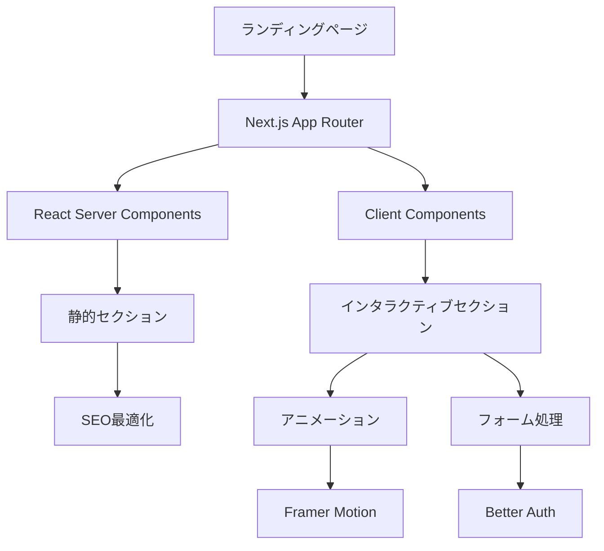
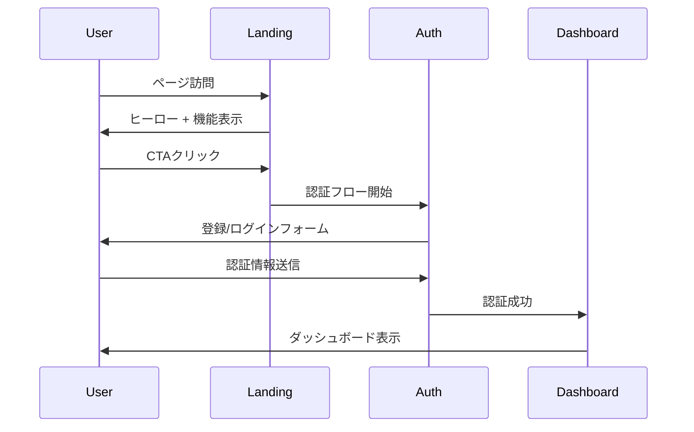
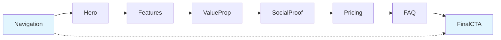
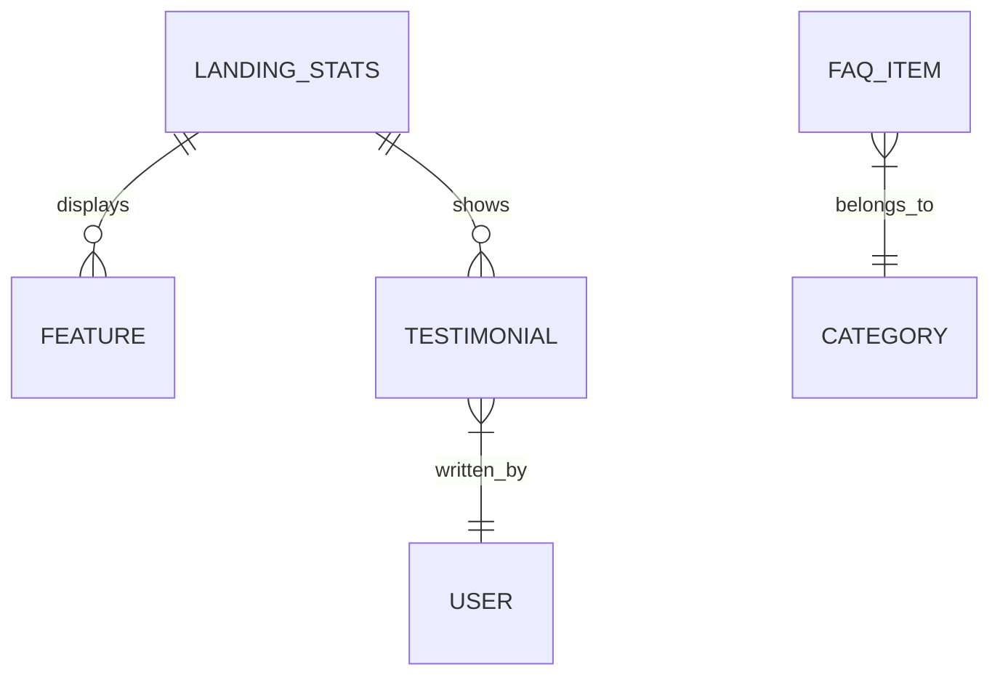
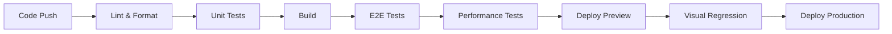

# ランディングページ技術設計書

## 概要

読書管理アプリケーションのランディングページをFlier風のモダンなデザインで実装する技術設計書。Next.js 15 + React 19の最新機能を活用し、高パフォーマンスで魅力的なユーザー体験を提供する。

## 要件マッピング

### 設計コンポーネントトレーサビリティ
各設計コンポーネントは特定の要件に対応：
- **HeroSection** → REQ-1: ヒーローセクション（EARS 1.1-1.4）
- **FeaturesSection** → REQ-2: 機能紹介セクション（EARS 2.1-2.4）
- **ValuePropositionSection** → REQ-3: 価値提案セクション（EARS 3.1-3.4）
- **SocialProofSection** → REQ-4: ソーシャルプルーフセクション（EARS 4.1-4.4）
- **PricingSection** → REQ-5: 料金・プランセクション（EARS 5.1-5.4）
- **FAQSection** → REQ-6: FAQセクション（EARS 6.1-6.4）
- **Navigation** → REQ-7: CTAとナビゲーション（EARS 7.1-7.4）
- **レスポンシブシステム** → REQ-8: レスポンシブデザイン（EARS 8.1-8.4）
- **パフォーマンス最適化** → REQ-9: パフォーマンスと技術仕様（EARS 9.1-9.4）

### ユーザーストーリーカバレッジ
- **訪問者の価値理解**: HeroSection + ValuePropositionSection
- **機能理解**: FeaturesSection + FAQSection
- **信頼性確認**: SocialProofSection + PricingSection
- **登録動線**: Navigation + CTASection（全体統合）
- **デバイス最適化**: レスポンシブシステム（全体横断）

## アーキテクチャ

### 高レベルシステム設計



### 技術スタック
調査結果と要件分析に基づく最適な技術選択：

- **フロントエンド**: Next.js 15.4.6 + React 19.1.0 + TypeScript
- **スタイリング**: Tailwind CSS v4 + shadcn/ui components
- **アニメーション**: Framer Motion + CSS transforms
- **認証**: Better Auth integration
- **パフォーマンス**: React Server Components + Image optimization
- **テスト**: Vitest (unit) + Playwright (E2E)

### アーキテクチャ決定根拠
調査に基づく技術選択の理由：

- **Next.js 15 + React 19採用理由**: RSCによる初期レンダリング最適化とゼロJS達成
- **Server-First設計理由**: 3秒以内読み込み要件（REQ-9.1）への対応
- **shadcn/ui採用理由**: 既存アプリとの統一性とアクセシビリティ準拠
- **Framer Motion採用理由**: 60FPSアニメーション要件（REQ-9.4）への対応

## データフロー

### 主要ユーザーフロー
トップ3ユーザーフローのシーケンス図：



### セクション間データフロー



## コンポーネントとインターフェース

### Server Componentsアーキテクチャ
静的コンテンツ配信用の Server Components：

```typescript
// src/app/(dashboard)/page.tsx
export default async function LandingPage() {
  const stats = await getAppStats(); // Server-side data fetching
  
  return (
    <>
      <Navigation />
      <HeroSection />
      <FeaturesSection />
      <ValuePropositionSection />
      <SocialProofSection stats={stats} />
      <PricingSection />
      <FAQSection />
      <CTASection />
    </>
  );
}
```

### Client Componentsインターフェース
インタラクティブ機能用の Client Components：

| コンポーネント | 責任 | Props/State概要 |
|---------------|------|----------------|
| NavigationClient | スティッキーナビ、スクロール検知 | `isScrolled: boolean` |
| HeroAnimation | ヒーローアニメーション | `variants: MotionVariants` |
| FeatureCard | 機能カードアニメーション | `feature: Feature, index: number` |
| TestimonialCarousel | レビューカルーセル | `testimonials: Testimonial[]` |
| FAQAccordion | アコーディオン開閉 | `items: FAQItem[], openIndex: number` |
| CTAButton | CTA動線制御 | `variant: primary \| secondary, href: string` |


## データモデル
**APIは作成しないため、データはハードコーディングの模擬データを表示**

### ドメインエンティティ
1. **LandingStats**: アプリ統計情報
2. **Testimonial**: ユーザーレビュー
3. **FAQItem**: よくある質問
4. **Feature**: 機能紹介データ

### エンティティ関係図



### データモデル定義
TypeScriptインターフェースによる型定義：

```typescript
type LandingStats = {
  userCount: number;
  bookCount: number;
  mentalMapCount: number;
  updatedAt: Date;
}

type Feature = {
  id: string;
  title: string;
  description: string;
  icon: string;
  highlighted?: boolean;
}

type Testimonial = {
  id: string;
  userName: string;
  content: string;
  rating: number;
  avatarUrl?: string;
}

type FAQItem = {
  id: string;
  question: string;
  answer: string;
  category: string;
  priority: number;
}
```

## エラーハンドリング

### エラー処理戦略
包括的なエラーハンドリングアプローチ：

```typescript
// src/lib/error-boundary.tsx
'use client';

export default function LandingErrorBoundary({
  error,
  reset,
}: {
  error: Error & { digest?: string };
  reset: () => void;
}) {
  return (
    <div className="min-h-screen flex items-center justify-center">
      <div className="text-center">
        <h2 className="text-xl font-semibold mb-4">
          ページの読み込みに失敗しました
        </h2>
        <Button onClick={reset}>再試行</Button>
      </div>
    </div>
  );
}
```

## セキュリティ考慮事項

### 認証・認可
- **認証フロー**: Better Authによるセキュアな認証（Argon2ハッシュ化）
- **セッション管理**: HTTPOnlyクッキーによるセッション保護
- **CSRF対策**: Better Auth内蔵のCSRF保護

### データ保護
- **入力検証**: Zodスキーマによる全入力検証
- **XSS対策**: React自動エスケープ + DOMPurify
- **セキュリティヘッダー**: Next.js built-inセキュリティ設定

```typescript
// next.config.ts
const config: NextConfig = {
  async headers() {
    return [
      {
        source: '/(.*)',
        headers: [
          {
            key: 'X-Frame-Options',
            value: 'DENY',
          },
          {
            key: 'X-Content-Type-Options',
            value: 'nosniff',
          },
          {
            key: 'Referrer-Policy',
            value: 'origin-when-cross-origin',
          },
        ],
      },
    ];
  },
};
```

## パフォーマンス・スケーラビリティ

### パフォーマンス目標
要件対応による具体的指標：

| メトリック | 目標値 | 測定方法 |
|------------|--------|----------|
| 初回表示時間 (FCP) | < 1.5秒 | Lighthouse |
| 最大コンテンツ描画 (LCP) | < 2.5秒 | Core Web Vitals |
| 累積レイアウトシフト (CLS) | < 0.1 | Core Web Vitals |
| 初回入力遅延 (FID) | < 100ms | Real User Monitoring |
| アニメーションフレームレート | 60 FPS | Performance API |

### キャッシュ戦略
パフォーマンス最適化のための多層キャッシュ：

- **CDN キャッシュ**: 静的アセット（24時間）
- **ブラウザキャッシュ**: 画像、フォント（7日間）
- **ISR キャッシュ**: 統計データ（1時間）
- **メモリキャッシュ**: APIレスポンス（5分間）

### スケーラビリティアプローチ
- **静的生成**: ISRによる統計データ定期更新
- **画像最適化**: Next.js Image with WebP/AVIF
- **コード分割**: Dynamic importによる必要時読み込み
- **CDN配信**: Vercel Edge Networkによるグローバル配信

## テスト戦略

### テストカバレッジ要件
テスト品質保証のための具体的指標：

- **ユニットテスト**: ≥85% コードカバレッジ
- **統合テスト**: 全APIエンドポイントと重要なユーザーフロー
- **E2Eテスト**: 主要な変換ファネル
- **パフォーマンステスト**: Core Web Vitals監視

### テストアプローチ

#### 1. ユニットテスト
各コンポーネントの独立テスト：

```typescript
// src/components/__tests__/HeroSection.test.tsx
import { render, screen } from '@testing-library/react';
import { HeroSection } from '../landing/HeroSection';

describe('HeroSection', () => {
  it('should display main copy and CTA button', () => {
    render(<HeroSection />);
    
    expect(screen.getByText('意図的読書で学習効果を最大化')).toBeInTheDocument();
    expect(screen.getByText('無料で始める')).toBeInTheDocument();
  });
  
  it('should redirect to auth on CTA click', () => {
    render(<HeroSection />);
    const ctaButton = screen.getByText('無料で始める');
    
    expect(ctaButton).toHaveAttribute('href', '/auth/register');
  });
});
```

#### 2. E2Eテスト
重要ユーザージャーニーのテスト：

```typescript
// tests/e2e/landing-conversion.spec.ts
import { test, expect } from '@playwright/test';

test('complete landing page conversion flow', async ({ page }) => {
  await page.goto('/');
  
  // ヒーローセクション確認
  await expect(page.getByText('意図的読書で学習効果を最大化')).toBeVisible();
  
  // CTAクリック
  await page.getByText('無料で始める').click();
  
  // 認証ページ遷移確認
  await expect(page).toHaveURL('/auth/register');
});
```

#### 3. パフォーマンステスト
Core Web Vitals監視：

```typescript
// tests/performance/landing-performance.spec.ts
import { test, expect } from '@playwright/test';

test('landing page performance metrics', async ({ page }) => {
  await page.goto('/');
  
  const performanceEntries = await page.evaluate(() => {
    return JSON.stringify(performance.getEntriesByType('navigation'));
  });
  
  const metrics = JSON.parse(performanceEntries)[0];
  expect(metrics.loadEventEnd - metrics.fetchStart).toBeLessThan(3000);
});
```

### CI/CDパイプライン



#### パイプライン設定
```yaml
# .github/workflows/landing-page.yml
name: Landing Page CI/CD
on:
  push:
    paths: ['src/app/(dashboard)/page.tsx', 'src/components/landing/**']

jobs:
  test:
    runs-on: ubuntu-latest
    steps:
      - uses: actions/checkout@v4
      - uses: oven-sh/setup-bun@v1
      
      - name: Install dependencies
        run: bun install
        
      - name: Run unit tests
        run: bun test:unit
        
      - name: Build application
        run: bun build
        
      - name: Run E2E tests
        run: bun test:e2e
        
      - name: Performance audit
        run: bun lighthouse:ci
```

## 実装ファイル構造

### ディレクトリ組織
bulletproof-react準拠のFeature-based構造：

```
src/
├── app/
│   └── (dashboard)/
│       └── page.tsx                    # メインランディングページ
├── components/
│   └── landing/                        # ランディング専用コンポーネント
│       ├── HeroSection.tsx            
│       ├── FeaturesSection.tsx         
│       ├── ValuePropositionSection.tsx 
│       ├── SocialProofSection.tsx      
│       ├── PricingSection.tsx          
│       ├── FAQSection.tsx              
│       ├── Navigation.tsx              
│       └── shared/                     # 共通コンポーネント
│           ├── CTAButton.tsx           
│           ├── FeatureCard.tsx         
│           ├── TestimonialCard.tsx     
│           └── AnimatedSection.tsx     
├── lib/
│   └── landing/                        # ランディング専用ロジック
│       ├── api.ts                      # API呼び出し
│       ├── animations.ts               # アニメーション設定
│       └── constants.ts                # 定数定義
└── types/
    └── landing.ts                      # ランディング用型定義
```

### 主要ファイル実装例

#### メインページファイル
```typescript
// src/app/(dashboard)/page.tsx
import { Suspense } from 'react';
import { HeroSection } from '~/components/landing/HeroSection';
import { FeaturesSection } from '~/components/landing/FeaturesSection';
import { SocialProofSection } from '~/components/landing/SocialProofSection';
import { getLandingStats } from '~/lib/landing/api';
import type { Metadata } from 'next';

export const metadata: Metadata = {
  title: '読書管理アプリ - 意図的読書で学習効果を最大化',
  description: 'メンタルマップ機能で読書前の意図を設定し、学習効果を最大化する読書管理アプリ',
  openGraph: {
    title: '読書管理アプリ - 意図的読書で学習効果を最大化',
    description: 'メンタルマップ機能で読書前の意図を設定し、学習効果を最大化',
    images: ['/og-image.jpg'],
  },
};

export default async function LandingPage() {
  return (
    <main className="min-h-screen">
      <HeroSection />
      <FeaturesSection />
      <ValuePropositionSection />
      <Suspense fallback={<StatsLoading />}>
        <SocialProofSectionWithData />
      </Suspense>
      <PricingSection />
      <FAQSection />
      <CTASection />
    </main>
  );
}

async function SocialProofSectionWithData() {
  const stats = await getLandingStats();
  return <SocialProofSection stats={stats} />;
}
```

この技術設計書は、要件書で定義された9つの要件すべてに対応し、Next.js 15 + React 19の最新機能を活用した高パフォーマンスなランディングページの実装指針を提供します。